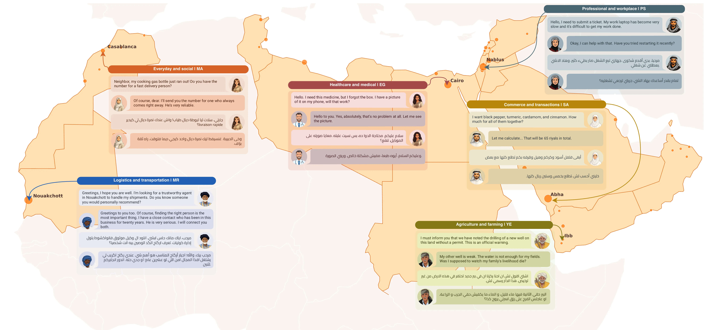

# Alexandria: A Multi-Domain Dialectal Arabic Machine Translation Dataset for Culturally Inclusive and Linguistically Diverse LLMs

<p align="center">
<b>Alexandria covers 13 Arab countries, 11 domains, and 107K community-driven samples.</b>
</p>

<p align="center">
  
</p>

[](https://arxiv.org/abs/2601.13099)
[](https://arxiv.org/abs/2601.13099)
[](https://arxiv.org/abs/2601.13099)
[](https://arxiv.org/abs/2601.13099)
[](https://alexandria.dlnlp.ai/)
[](https://huggingface.co/datasets/UBC-NLP/alexandria)
[](guidelines/Alexandria_MT_Translation_Phase_Guidelines.pdf)
[](guidelines/Alexandria_MT_Revision_Phase_Guidelines.pdf)

This repository accompanies the *Alexandria* paper and collects the project assets used to build and evaluate a benchmark for **Dialectal Arabic Machine Translation**, **Arabic dialect translation**, **English-to-dialect Arabic translation**, **dialect-to-English translation**, and **multi-turn conversational MT**. Alexandria is organized into four splits: **Train**, **Dev**, **Public Test**, and **Private Test**. This repository focuses on the materials behind the dataset creation pipeline: prompt templates for English source conversation generation, participant guidelines for translation and revision, and the evaluation area for benchmarking Arabic MT systems and LLMs on the Alexandria public test set.

## 🌟 Overview
*Alexandria* is introduced in the paper [*Alexandria: A Multi-Domain Dialectal Arabic Machine Translation Dataset for Culturally Inclusive and Linguistically Diverse LLMs*](https://arxiv.org/abs/2601.13099). The project targets a persistent gap in Arabic NLP: strong support for Modern Standard Arabic but much weaker coverage of dialectal Arabic, especially in realistic, culturally grounded conversational settings.

This repository organizes the Alexandria resources used across the creation workflow and the public-test evaluation setup for **dialectal Arabic MT**, **city-level Arabic dialect translation**, **culturally grounded machine translation**, **code-switching-aware translation**, **gender-aware translation**, and **Arabic LLM evaluation**.

**Keywords:** dialectal Arabic machine translation, Arabic dialect translation, conversational machine translation, multi-turn MT, city-level dialect benchmarking, English-dialect parallel data, culturally grounded Arabic NLP, code-switching, persona-aware translation, gender-conditioned translation, Arabic LLM evaluation.

## 📊 Dataset Statistics
Alexandria contains `106,990` total turns (`~107K`) across 13 Arab country contexts and 11 domains. The dataset is city-level, multi-turn, English `<->` Dialect Arabic, averages `13.23` words per turn, and has `0.826` Distinct-2 lexical diversity.

## 🧪 Dataset Splits
Alexandria is organized into four standard benchmark splits:

- `Train`
- `Dev`
- `Public Test`
- `Private Test`

The `Public Test` split is intended for open benchmarking and reproducible reporting, while the `Private Test` split supports held-out evaluation.

## 📦 Dataset Access
You can access Alexandria directly from Hugging Face using the `datasets` library. The example below loads a specific country subset and reads the first English and dialectal turns from the training split.

- Hugging Face dataset: [UBC-NLP/alexandria](https://huggingface.co/datasets/UBC-NLP/alexandria)

```python
from datasets import load_dataset

# Load a specific country subset (e.g., 'MA' for Morocco, 'EG' for Egypt)
dataset = load_dataset("UBC-NLP/alexandria", name="MA")

# Access the train split (choose test if you want to access the public test)
train_data = dataset['train']

# View the first parallel turn of the first conversation
first_conv = train_data[0]
eng_turn = first_conv['english_conversation'][0]
dialect_turn = first_conv['dialectal_conversation'][0]

print(f"English: {eng_turn['text']}")
print(f"Dialect: {dialect_turn['text']}")
```

The 13 dialect settings covered in Alexandria are **Jordanian Arabic**, **Lebanese Arabic**, **Palestinian Arabic**, **Syrian Arabic**, **Saudi Arabic**, **Omani Arabic**, **Yemeni Arabic**, **Egyptian Arabic**, **Sudanese Arabic**, **Libyan Arabic**, **Moroccan Arabic**, **Mauritanian Arabic**, and **Tunisian Arabic**.

Regional grouping in the table below:

- `Levant`: JO (Jordanian Arabic), LB (Lebanese Arabic), PS (Palestinian Arabic), SY (Syrian Arabic)
- `Gulf`: SA (Saudi Arabic), OM (Omani Arabic), YE (Yemeni Arabic)
- `Nile`: EG (Egyptian Arabic), SD (Sudanese Arabic)
- `Maghreb`: LY (Libyan Arabic), MA (Moroccan Arabic), MR (Mauritanian Arabic), TN (Tunisian Arabic)

| Domain | JO | LB | PS | SY | SA | OM | YE | EG | SD | LY | MA | MR | TN | Total |
| --- | ---: | ---: | ---: | ---: | ---: | ---: | ---: | ---: | ---: | ---: | ---: | ---: | ---: | ---: |
| Agriculture/Farming | 825 | 1140 | 1770 | 931 | 1162 | 915 | 529 | 583 | 163 | 231 | 570 | 970 | 481 | 10270 |
| Commerce/Transactions | 750 | 1004 | 1595 | 749 | 1020 | 650 | 579 | 506 | 201 | 160 | 445 | 757 | 401 | 8817 |
| Construction/Real Estate | 859 | 995 | 1761 | 861 | 1161 | 974 | 696 | 660 | 225 | 271 | 574 | 673 | 485 | 10195 |
| Education/Academia | 816 | 1191 | 1513 | 831 | 1017 | 1079 | 563 | 549 | 170 | 220 | 601 | 863 | 551 | 9964 |
| Energy/Resources | 786 | 1048 | 1715 | 928 | 1177 | 937 | 587 | 625 | 189 | 243 | 447 | 719 | 470 | 9871 |
| Everyday/Social | 967 | 1215 | 1697 | 787 | 1020 | 888 | 642 | 604 | 175 | 210 | 595 | 824 | 550 | 10174 |
| Healthcare/Medical | 727 | 1240 | 1728 | 781 | 1043 | 895 | 548 | 487 | 164 | 253 | 556 | 948 | 522 | 9892 |
| Legal/Financial | 693 | 1006 | 1566 | 757 | 857 | 753 | 496 | 539 | 177 | 174 | 481 | 642 | 412 | 8553 |
| Logistics/Transport | 842 | 1020 | 1512 | 950 | 1234 | 842 | 629 | 646 | 189 | 187 | 593 | 877 | 515 | 10036 |
| Professional/Workplace | 845 | 1220 | 1810 | 959 | 1112 | 866 | 549 | 645 | 178 | 253 | 480 | 709 | 526 | 10152 |
| Tourism/Hospitality | 720 | 1161 | 1596 | 884 | 1004 | 815 | 608 | 608 | 190 | 216 | 567 | 878 | 460 | 9707 |
| **Total** | **8830** | **12240** | **18263** | **9418** | **11807** | **9614** | **6426** | **6452** | **2021** | **2418** | **5909** | **8860** | **5373** | **107631** |

## 🔍 Comparison with Other Dialectal Arabic MT Datasets
Alexandria is designed to extend prior Arabic dialect MT resources with broader domain coverage, multi-turn conversational structure, local context, code-switching support, gender-direction annotations, and persona roles.

| Dataset | # Sentence Pairs / Turns | # Dialects | Granularity | Src Type | Direction | # Domains | Avg. words | Distinct-2 | LC | CS | GD | PR |
| --- | ---: | ---: | --- | --- | --- | ---: | ---: | ---: | --- | --- | --- | --- |
| PADIC (Meftouh et al., 2015) | 38K | 6 | Country | Sentence | Eng `<->` Dialect | 1 | 6.77 | 0.782 | No | No | No | No |
| MADAR (Bouamor et al., 2018) | 100K | 13 | City | Sentence | Eng `<->` Dialect | 1 | 5.73 | 0.768 | No | No | No | No |
| FLORES+ (Team et al., 2022) | 16K | 9 | Country | Sentence | Eng `<->` Dialect | 3 | 18.39 | 0.898 | No | No | No | No |
| **Alexandria (ours)** | **107K** | **13** | **City** | **Multi-turn** | **Eng `<->` Dialect** | **11** | **13.23** | **0.826** | **Yes** | **Yes** | **Yes** | **Yes** |

`LC` = Local Context, `CS` = Code-Switching, `GD` = gender-direction annotations, `PR` = persona roles.

## 🗂️ Repository Structure
```text
.
├── evaluation_code/
├── guidelines/
│   ├── Alexandria_MT_Revision_Phase_Guidelines.pdf
│   └── Alexandria_MT_Translation_Phase_Guidelines.pdf
├── images/
│   └── alexandria_overview.webp
└── prompts/
    ├── coversations_generation_prompt.txt
    ├── *_prompt.txt
    └── topics_examples/
```

### `prompts/`
The `prompts/` directory covers the prompts used per domain to generate the English source conversations that were later translated into local dialects and languages. It includes:

- Domain-specific prompt (for topics generation) files for:
  `agriculture_farming`, `commerce_transactions`, `construction_real_estate`, `education_academia`, `energy_resources`, `everyday_social`, `healthcare_medical`, `legal_financial`, `logistics_transportation`, `professional_workplace`, and `tourism_hospitality`
- Example topic files under `prompts/topics_examples/` for the same set of domains
- A shared instruction template (for conversations generation) in `coversations_generation_prompt.txt`


### `guidelines/`
The `guidelines/` directory contains the documents given to participants during the human data creation stages:

- `Alexandria_MT_Translation_Phase_Guidelines.pdf` for the translation phase
- `Alexandria_MT_Revision_Phase_Guidelines.pdf` for the revision phase

### `evaluation_code/`
The `evaluation_code/` directory covers the evaluation code for running Alexandria benchmarking on your own models, with the public evaluation setup centered on the `Public Test` split.


## 🧩 Domains Covered
Alexandria spans 11 practical domains designed to reflect everyday and specialized communication across Arab communities:

- Agriculture and farming
- Commerce and transactions
- Construction and real estate
- Education and academia
- Energy and resources
- Everyday social interactions
- Healthcare and medical settings
- Legal and financial settings
- Logistics and transportation
- Professional workplace communication
- Tourism and hospitality

## 📝 Citation
If you use this repository or the Alexandria dataset in your research, please cite the paper:

```bibtex
@misc{mekki2026alexandriamultidomaindialectalarabic,
      title={Alexandria: A Multi-Domain Dialectal Arabic Machine Translation Dataset for Culturally Inclusive and Linguistically Diverse LLMs}, 
      author={Abdellah El Mekki and Samar M. Magdy and Houdaifa Atou and Ruwa AbuHweidi and Baraah Qawasmeh and Omer Nacar and Thikra Al-hibiri and Razan Saadie and Hamzah Alsayadi and Nadia Ghezaiel Hammouda and Alshima Alkhazimi and Aya Hamod and Al-Yas Al-Ghafri and Wesam El-Sayed and Asila Al sharji and Mohamad Ballout and Anas Belfathi and Karim Ghaddar and Serry Sibaee and Alaa Aoun and Areej Asiri and Lina Abureesh and Ahlam Bashiti and Majdal Yousef and Abdulaziz Hafiz and Yehdih Mohamed and Emira Hamedtou and Brakehe Brahim and Rahaf Alhamouri and Youssef Nafea and Aya El Aatar and Walid Al-Dhabyani and Emhemed Hamed and Sara Shatnawi and Fakhraddin Alwajih and Khalid Elkhidir and Ashwag Alasmari and Abdurrahman Gerrio and Omar Alshahri and AbdelRahim A. Elmadany and Ismail Berrada and Amir Azad Adli Alkathiri and Fadi A Zaraket and Mustafa Jarrar and Yahya Mohamed El Hadj and Hassan Alhuzali and Muhammad Abdul-Mageed},
      year={2026},
      eprint={2601.13099},
      archivePrefix={arXiv},
      primaryClass={cs.CL},
      url={https://arxiv.org/abs/2601.13099}, 
}
```


## 🤝 Contact
For questions, corrections, or feedback, please open an issue in this repository.
