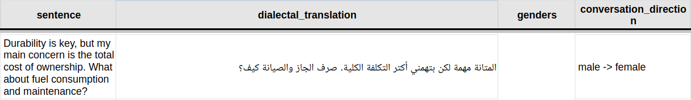
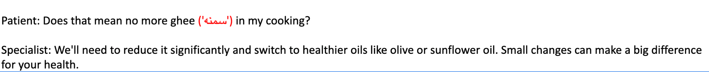
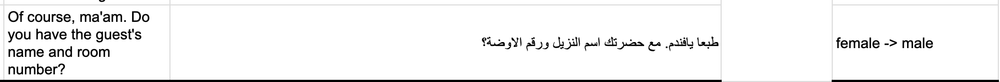
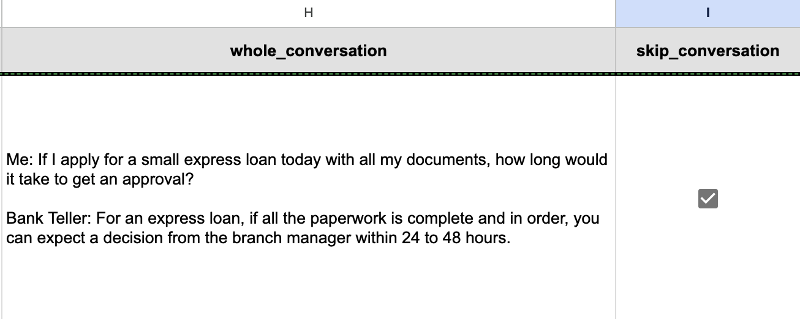

**<u>Alexandria MT Community Project Guidelines</u>**

**Objective:**

Creating a multidialectal MT dataset covering **14** countries and
**11** diverse domains. The data consists of casual conversations
reflecting daily life and social interactions, including scenarios such
as storytelling, expressing emotions, making plans, service encounters
(e.g., in shops, restaurants, public transport, and government
services), personal communications (e.g., emails, text messages), and
humorous exchanges such as jokes.

**Task:** Provide high-quality, human-generated dialectal translations
across diverse domains.

**Countries covered**

- Morocco

- Egypt

- Syria

- Palestine

- Jordan

- UAE

- Saudi Arabia

- Algeria

- Mauritania

- Sudan

- Yemen

- Libya

- Tunisia

- Lebanon

**Domains**

Scenarios from a wide range of domains, including:

- Agriculture & Farming

- Commerce & Transactions

- Construction & Real Estate

- Education & Academia

- Energy & Resources

- Everyday & Social

- Healthcare & Medical

- Legal & Financial

- Logistics & Transportation

- Professional & Workplace

- Tourism & Hospitality

**Project Goals and Outcomes**

The Alexandria community project aims to develop a large-scale,
multi-dialectal, and multi-domain machine translation dataset annotated
through crowdsourcing. The primary deliverables of this project are:

- **A Public Dataset:** The final, curated dataset will be made publicly
  available to the research community. It will serve as a valuable
  resource for training, fine-tuning, and evaluating machine translation
  models that handle translation to and from Arabic dialects.

<!-- -->

- **A Research Paper:** A comprehensive paper will be authored to
  describe the dataset's creation, our annotation methodology, and key
  findings. This paper will be submitted for publication in a
  peer-reviewed top-tier conference.

**Authorship Policy**

Participation in the project includes an opportunity for co-authorship
on the resulting research paper. Authorship order will be determined by
the level of contribution (translation + revision).

- **Eligibility Criteria**

To qualify for co-authorship, each project member must meet the
following minimum contribution requirements:

- **Translation:** Contribute **<u>3,000</u>** unique translations that
  successfully pass the project's internal quality review.

- **Review:** Complete **<u>3,000</u>** unique reviews of sentences
  translated by other participants.

<!-- -->

- **Acknowledgements**

Members who contribute to the project but <u>do not meet the full
authorship threshold</u> will be formally recognized by name in the
**acknowledgements section** of the final paper.

**Annotation Process**

1.  **Tool**

To facilitate collaboration, we've chosen **Google Spreadsheets** as an
accessible platform for all participants. Each annotator will be given a
dedicated spreadsheet. This spreadsheet will include essential
information such as the **sentence ID, the specific sentences designated
for translation, the genders of individuals in the conversation, the
direction of the conversation flow, and the complete conversation
transcript.**

2.  **Annotators’ Information**

Participants should specify the micro-dialect they represent. For
example, a participant from Morocco should clarify if they are
translating into the **Fez dialect** or the **Rabat dialect** (or
another dialect if applicable).

**How to annotate?**

1.  **General Rules**

**Note: Do not use any language models (LLMs) or automated tools for
translation**.

> **1.1.** Ensure that you **<u>translate into your local dialect</u>**.
> For example, if you are from Egypt and live in Cairo, use the
> expressions and style typical of how the dialect is spoken in your
> city.
>
> **1.2.** Review the entire conversation for overall context and
> identify **the domain** you are translating to, for example, a
> conversation is taking place between a bank teller and a client.
>
> **1.3.** Take into account the **gender** of the speaker you are
> translating for.
>
> **E.g.**, the translation of the English sentence "I am waiting for
> you" to Egyptian dialect is:

- **Male → Male:** أنا مستنيك

- **Male → Female:** أنا مستنيكي

- **Female → Male:** أنا مستنياك

- **Female → Female:** أنا مستنياكي

**Note: If you encounter a conversation with inaccurate or flipped
genders, you can either skip it (by checking the skip box) or translate
the sentences as they are. If you choose to translate, please write
'Wrong genders' in the notes column (we will correct them
accordingly).**

> **1.4.** Ensure the translation reflects your specific **local
> dialect** **<u>(Highly Dialectal)</u>**.

<table style="width:92%;">
<colgroup>
<col style="width: 92%" />
</colgroup>
<thead>
<tr>
<th><ul>
<li>
<strong>✅Highly dialectal example:</strong> “Whatever, you just
have no taste” in Egyptian dialect could be “فكك، إنت
شكلك معندكش ذوق في الأغاني”.
</li>
<li>
<strong>❌Less Dialectal example:</strong> “I agree in principle,
but how do we ensure this flexibility doesn't lead to chaos” “أنا موافق على المبدأ، بس إزاي هنضمن ان المرونة دي مش
<strong><mark>هتؤدي</mark></strong> لهرجلة”
</li>
</ul></th>
</tr>
</thead>
<tbody>
</tbody>
</table>

<table style="width:92%;">
<colgroup>
<col style="width: 92%" />
</colgroup>
<thead>
<tr>
<th><ul>
<li>
For any word, <strong>please write it the way you normally would
on social media or in a text message, using its common spelling</strong>
(e.g., write "He said" as <strong><mark>قال</mark></strong>) and not a spelling based only on
its sound (e.g., <strong><mark>آل</mark></strong>).
</li>
</ul></th>
</tr>
</thead>
<tbody>
</tbody>
</table>

2.  **Code Switched & Foreign Words**

> **2.1.** If you feel that the dialectal translation would involve
> code-switching (e.g., professional workplace scenarios), then the
> **code-switched words or expressions should be written in Latin
> script**.
>
> **E.g.**, “Please send the file via email and upload it to the drive.”
> can be translated to “عافاك صيفتلي داك ل
> **<u>fichier</u>** فالايميل
> و حطو فال **<u>drive</u>**.”.
>
> **Note:** Don’t provide two translations in the same sentence by
> putting the **code switched** word/s between parentheses, for example:
> “We could approve **overtime** for …”
> ممكن نوافق على
> **شغل إضافي (أوفر
> تايم)** للأنشطة الأساسية” you
> should provide one translation, no need for adding the parentheses.
>
> **2.2.** For **scientific words** (e.g., medication or technical
> names) that do not have a dialectal Arabic equivalent, you can use the
> English word.
>
> **E.g.**, "The problem is with the motherboard; it needs to be
> replaced." can be translated to "المشكلة في الـ
> **<u>motherboard</u>**، لازم
> تتغير."
>
> **E.g.,** “Right away. Let me get those for you. So that's three boxes
> of the **<u>metformin</u>** and two of the
> **<u>captopril</u>**, correct?”. The words
> ‘**<u>metformin</u>**’ and
> ‘**<u>captopril</u>**’ are names of
> medications; these names should be kept as they are for the dialectal
> translation.

3.  **Translating Digits & Phone Numbers**

> **3.1. Digits** should be translated into **<u>written letters</u>**.
>
> **E.g.**, “I need **2** minutes”.

- Translation to Moroccan dialect is “خاصني
  **جوج**
  دقايق”.

> **3.2.** **<u>Phone numbers, emails, and IDs</u>** are anonymized.
> Therefore, keep them in the same format when translating.
>
> **E.g**., “Of course, my number is **06 XX XX XX
> XX.**”

- Translation to Moroccan dialect is “الله أودي, النمرة
  ديالي هي **06**
  **XX XX XX XX**.”

4.  **Special Cases**

> **4.1.** Some Arabic words don’t have equivalent translations in
> English. So, the Arabic word is used. For example,
> **‘<u>خلع</u>’**
> (type of divorce) in English is
> ‘**<u>Khul</u>**’.
>
> **4.2.** Expressions such as ‘**Peace be upon
> you**’ should be translated into their corresponding dialectal
> translations. ‘Peace be upon you’ →
> **‘السلام عليكم**’,
> ‘**God willing**’ →
> ‘**إن شاء الله**’.
>
> **4.3.** If the English sentence starts with
> **“Hi”** and you translate it as
> **“مرحبا”**, it’s
> better to also provide alternative translations in your dialect,
> especially if there are multiple ways to say “Hi” in that dialect.
>
> **4.4.** Some sentences may include acronyms or abbreviations—please
> keep them unchanged in the translation. For example, “We also require
> a **GOSI** statement” should be
> نحتاج برضو بيان من التأمينات
> (**GOSI**).
>
> **4.5.** If there’s a borrowed word in the source text that doesn’t
> have a clear equivalent in your dialect, just use it the way people
> normally do in your dialect. For example, the word
> **“taxi”** in English doesn’t have a native
> equivalent in Egyptian Arabic, so people say
> **“تاكسي”, “تاكسيات”, or
> “تكاسي”.**
>
> **4.6.** If the source sentence contains an English word that does not
> have a direct equivalent in your dialect and is generally understood
> in a broad sense, translate it as people normally say it in your local
> dialect. For example, the English word
> **“fuel”** is typically translated into
> Modern Standard Arabic as
> **“وقود”**, which is
> the general meaning. However, in **Sudanese** Arabic, the common term
> is **“جاز”**.
>
>  style="width:6.5in;height:0.95833in" />

5.  **Punctuation Marks**

- Regarding **punctuation marks**: translate the sentences and use the
  punctuation you would normally use in your local dialect. Keep in mind
  that English punctuation marks are sometimes different from Arabic
  ones. Check this example from the **Palestinian** dialect for
  clearance:

  - **English:** I wouldn't risk it, **<u>my friend.
    This</u>** performance usually sells out quickly. It's better
    to buy your ticket now.

  - **Palestinian dialect:** والله لو أنا ما بخاطر يا
    **<u>صديقي، هاد</u>**
    العرض غالباً بخلّصوا تذاكره بسرعة، أحسنلك إشتري
    التّذكرة هسا.

6.  **Style**

> **6.1. Translate at the sentence level:** Read the conversation for
> context, but do not incorporate details from other lines or make
> assumptions beyond the sentence you are translating. Check this
> Example (From English to Moroccan dialect) for clearance:

<table style="width:93%;">
<colgroup>
<col style="width: 30%" />
<col style="width: 30%" />
<col style="width: 30%" />
</colgroup>
<thead>
<tr>
<th style="text-align: left;"><strong>Context</strong></th>
<th colspan="2" style="text-align: center;">
Hello, what is the dish
of the day?

Good afternoon. Today’s special is a sea bream tagine with potatoes
and olives.
</th>
</tr>
<tr>
<th style="text-align: left;"><strong>English Sentence</strong></th>
<th style="text-align: center;"><strong>❌</strong></th>
<th style="text-align: center;"><strong>✅</strong></th>
</tr>
<tr>
<th style="text-align: left;">Hello, what is the dish of the day?</th>
<th style="text-align: left;">السلام, شنو كاين
<strong>فالطاجين</strong> ديال اليوم؟</th>
<th style="text-align: left;">السلام, شنو كاين
<strong>فالطبق</strong> ديال اليوم؟</th>
</tr>
</thead>
<tbody>
</tbody>
</table>

> **6.2. Level of formality:** If the context of a conversation suggests
> some level of formality, such as between a teacher and a student, you
> may include a small degree of formality in your translation. However,
> we emphasize that you should use the same manner you would naturally
> use when addressing people in such situations in real life. Translate
> as you would actually speak in reality For example,
> حضرتك vs. انت. **Example
> for your reference:**

7.  **What to do when you are not able to understand the English
    sentence or find an equivalent dialectal Arabic?**

> **7.1.** Check **Google Translate** for the translation of a word.
>
> **7.2.** Check **Google Images** for a visual representation of the
> object.
>
> **E.g.**, the English word ‘sweater’ in Moroccan is
> ‘تريكو’.

8.  **When to skip a sentence?**

**Note: If one sentence is not suitable for translation, then the whole
conversation should be skipped.**

**Other cases could include:**

> **8.1.** Sentences contain **Arabic expressions** (written in Arabic
> script) .
>
>  style="width:6.00521in;height:0.61592in" />
>
> **8.2.** Sentences contain non-English expressions that can be
> expressed in English (e.g., ‘**si**
> Mohammed’ or ‘**Lalla** Fatima’…).
>
> **8.3.** The entire conversation should be excluded from the dataset
> if **it does not accurately represent the target culture for various
> reasons** (e.g., inappropriate scenarios). For example,
> **Ms. El-Masry**, in the Egyptian dialect,
> people typically use first names rather than last names when
> addressing others. So in this case, you should skip the entire
> conversation, not just the sentence.
>
>  style="width:6.19271in;height:1.31992in" />
>
> **8.4.** To determine if an expression is appropriate, consider
> whether its English translation would be acceptable in a dialectal
> text. For instance, including "Iftar" and “Suhoor” in an English text
> is acceptable. However, phrases like "Wa alaikum salam" are not, as
> they have a direct English equivalent.
>
> **8.5.** Some cases show that the **Gender
> direction of the conversation is flipped or** not correct in
> the correct order to the conversion. You should skip the whole
> conversation.
>
>  style="width:6.14063in;height:0.54167in" />

9.  **Checkboxes & Notes:**

**9.1.** For each sentence, you will have **2 checkboxes**:
‘***Skip_conversation***’ and ‘***multi_english_references***’:

- For ‘***Skip_conversation***’, you skip the whole conversation if:

  - The conversation is not relevant to the culture and does not sound
    well.

  - If one of the sentences is not suitable for translation.

>  style="width:6.5in;height:2.59722in" />

**9.2. If you have some notes about the translation of a specific
sentence, you can put them in the notes column.**

**<u>Note:</u> The 'multi_english_references' and
'multi_dialectal_references' checkboxes will be removed. You no longer
need to consider them.**

~~Deprecated:~~

- ~~The ‘multi_english_references’ checkbox is checked when you see that
  the English sentence can be written in other English forms. For
  example, ‘**Hello!** You won't believe what happened. Your cousin Mona
  got engaged!’ and ‘**Salamu Alaykum!** You won't believe what
  happened. Your cousin Mona got engaged!’ has the same meaning;
  therefore, that checkbox should be checked.~~

- ~~Check the ‘multi_dialectal_references’ checkbox when an English
  sentence can be translated into multiple dialectal variations. For
  example, ‘Hi’ can be translated as ‘أهلا’,
  ‘مرحبا’, or ‘السلام عليكم’. Similarly,
  ‘Thank you’ can be translated as ‘شكرا لك’ or
  ‘بارك الله فيك’.~~

