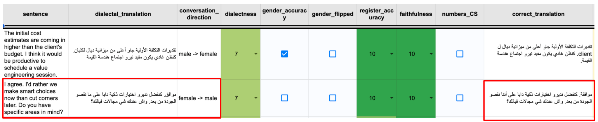
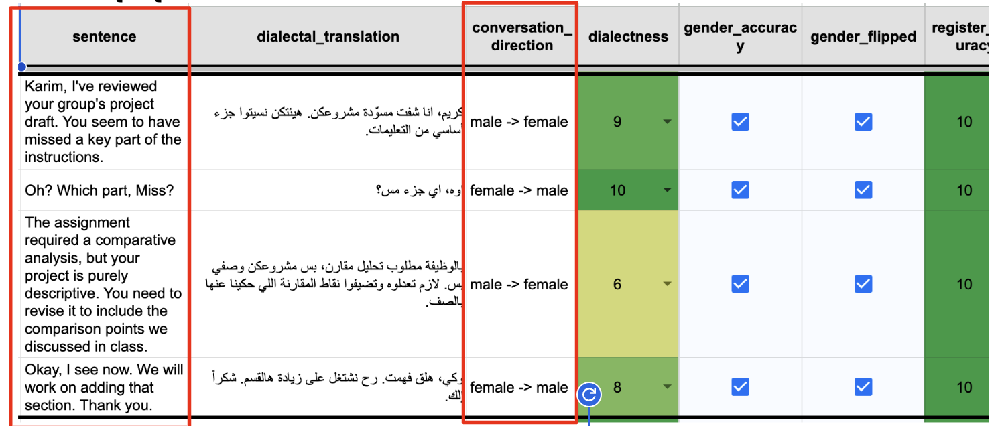

**[Alexandria MT Community Project Revisions Criteria:]{.underline}**

**Goal:** To assess the quality of the translation efficiently and with
minimal effort. We cover the main features of the translations to ensure
the highest possible data quality. The revision process will be carried
out by selecting **[checkboxes]{.underline}** from a dropdown menu in
the assigned sheets to verify specific items in the provided
translations. Then, if any errors exist in the original translation,
provide the corrected version.

**Task:** Each participant should complete **[3,000]{.underline}**
unique reviews of sentences translated by other participants.

The evaluation criteria include the following items:

1.  **Dialectness Level (dialectness column)**

> Measures how well the translation reflects the **features, vocabulary,
> and style** of a specific dialect rather than **MSA**. It evaluates
> how closely the translation resembles **the natural, real-world use**
> of that dialect.

**Score from 0 to 10:** Rate from **0** to **10** how the translation is
authentic to your country's dialect.

**0--2**: Wrong dialect/register; mostly **MSA** or another dialect.

**3--5**: Mixed dialect; multiple lexical giveaways; understandable but
inauthentic.

**6--7**: Generally correct with a few lexical or idiomatic mismatches.

**8--9**: Natural and city‑authentic; minor nitpicks only.

**10**: Native‑like, idiomatic, unmistakably from the target city.

+-----------------------------------------------------------------------+
| ✅**Highly Dialectal Translation**                                    |
|                                                                       |
| - **English Sentence:** Good morning. My goodness, it is so crowded   |
|   today! It was never this bad.                                       |
|                                                                       |
| - [صباح الخير. يا نهار مش فايت، إيه الزحمة الجامدة النهاردة دي! عمرها |
|   ما كانت بالمنظر ده.]{dir="rtl"}                                     |
|                                                                       |
| **Score: 9**                                                          |
|                                                                       |
| > []{dir="ltr"}                                                       |
|                                                                       |
| ❌**Less Dialectal Translation**                                      |
|                                                                       |
| - **English Sentence:** Great work, Omar. The insights are very       |
|   clear.                                                              |
|                                                                       |
| - [شغل رائع يا عمر. الرؤية واضحة جدا.]{dir="rtl"}                     |
|                                                                       |
| **Score: 5**                                                          |
+=======================================================================+

2.  **Gender Accuracy (gender_accuracy column)**

Check the **[gender direction]{.underline}** of the conversation and
ensure that the translation accurately matches the gender specified in
the **"Gender Direction"** column. If the translation aligns correctly,
**check the box** ✅.

**E.g.**, the translation of the English sentence **\"I am waiting for
you\"** to Egyptian dialect is:

> **Male → Male:** [أنا مستنيك]{dir="rtl"} ✅
>
> **Male → Female:** [أنا مستنيكي]{dir="rtl"} ✅
>
> **Female → Male:** [أنا مستنياك]{dir="rtl"} ✅
>
> **Female → Female:** [أنا مستنياكي]{dir="rtl"} ✅
>
> **Female → Female:** [أنا مستنياك]{dir="rtl"} ❌
>
> **Female → Male:** [أنا مستنيكي]{dir="rtl"} ❌
>
> {width="5.734375546806649in"
> height="1.1762817147856517in"}

3.  **Gender Flipped (gender_flipped column)**

- Check the box when the gendered language used in the text (the English
  one) directly **contradicts** the metadata in the
  **conversation_direction** column. This indicates an error in the
  provided metadata. Just check the box and we will fix this issue on
  our side.

**For example, if the source text is:**

"Sir, just to be sure, have you tried restarting your router?"

And the **conversation_direction** is listed as **male -\> female** (a
male speaking to a female), you should check **[the gender flipped
box]{.underline}**. The text explicitly addresses a male (\"Sir\"),
which conflicts with the \"female\" listener specified in the direction.

{width="6.5in"
height="2.763888888888889in"}

4.  **Register Appropriateness (register_accuracy column)**

**Register** means the level of formality in a text, which can be higher
or lower than what is appropriate based on the specifications or general
language conventions. So check the translation domain to make sure the
**register** is appropriate for the scenario (**e.g**., government
office, customer support, or friends chatting).

**Score from 0 to 10:**

**0--2**: Completely off (e.g., slang in official context).

**3--5**: Mixed tones; inconsistent honorifics.

**6--7**: Mostly appropriate; a few mismatches.

**8--9**: Strong match with consistent markers.

**10**: Perfectly tuned to context and roles.

5.  **Faithfulness**

Faithfulness measures how accurately the translation conveys the meaning
of the source text. A faithful translation captures all the original
information **without adding, omitting, or distorting it**. The goal is
to preserve the message, not necessarily the exact words or sentence
structure.

A practical way to check for this, especially for dialectal
translations, is to consider **back-translation (i.e., by translating
the text that has already been translated back into the original
language)**. Ask yourself: \"If this translation were translated back to
English by a fluent speaker, would it accurately convey the original
message?\" A highly faithful translation is one where the meaning is
preserved in both directions.

**Score from 0 to 10:**

**0--2**: Major meaning errors; misleading.

**3--5**: Several omissions/additions/mistranslations; halting.

**6--7**: Minor inaccuracies; overall understandable.

**8--9**: Accurate and fluent with minor edits.

**10**: Precise, idiomatic, publication‑ready.

+-----------------------------------------------------------------------+
| **[Example 1:]{.underline}**                                          |
|                                                                       |
| **English sentence:** Definitely keep them in your hand luggage.      |
| It\'s also a good idea to carry a letter from your doctor listing     |
| your medications.                                                     |
|                                                                       |
| **Dialectal translation:** [خليهم باليدوية. وكمان خذ ورقة من الدكتور  |
| بأسمائهم]{dir="rtl"}. ❌                                              |
|                                                                       |
| **Score: 3**                                                          |
|                                                                       |
| **Reason:** The translation is incorrect for **three main reasons**:  |
|                                                                       |
| - **First**, \"[باليدوية]{dir="rtl"}\" does not mean \"hand           |
|   luggage\"; it\'s an adjective meaning \"manual.\"                   |
|                                                                       |
| - **Second**, the command \"[كمان خد]{dir="rtl"}\" (also take) misses |
|   the gentle, advisory tone of \"It\'s also a good idea.\"            |
|                                                                       |
| - **Finally**, the phrase \"[بأسمائهم]{dir="rtl"}\" (with their       |
|   names) is an oversimplification of \"listing your medications,\"    |
|   which is more accurately translated as \"[فيها قايمة                |
|   بأدويتك]{dir="rtl"}\" (containing a list of your medications) to    |
|   convey the idea of a formal list.                                   |
+=======================================================================+

+-----------------------------------------------------------------------+
| **[Example 2:]{.underline}**                                          |
|                                                                       |
| **English sentence:** It's always weak on this side of the library.   |
| Try reconnecting, sometimes that helps.                               |
|                                                                       |
| **Dialectal translation:** [دائما **النت**]{dir="rtl"} [ضعيف بهذا     |
| الجزء من المكتبة. حاولي تكنكين مرة لخ, مرات هلشي ينجح]{dir="rtl"}. ❌ |
|                                                                       |
| **Score: 6**                                                          |
|                                                                       |
| **Reason:** The word **"[النت]{dir="rtl"}"** is not available in the  |
| original sentence.                                                    |
+=======================================================================+

+-----------------------------------------------------------------------+
| **[Example 3:]{.underline}**                                          |
|                                                                       |
| **English sentence:** Definitely keep them in your hand luggage.      |
| It\'s also a good idea to carry a letter from your doctor listing     |
| your medications.                                                     |
|                                                                       |
| **Dialectal translation:** [خليهم معك بالشنطة اليدوية. وبرضه منيح     |
| تاخد ورقة من الدكتور فيها أسماء الأدوية]{dir="rtl"}. ✅               |
|                                                                       |
| **Score: 9**                                                          |
|                                                                       |
| **Reason:**                                                           |
|                                                                       |
| All propositions present?\                                            |
| -- keep them + hand luggage ✅\                                       |
| -- carry a letter + doctor + listing medications ✅                   |
|                                                                       |
| No extra info added?✅                                                |
|                                                                       |
| Tone preserved (advice vs command)? ✅                                |
|                                                                       |
| Mapping is one English turn → one Arabic turn (regardless of sentence |
| count)? ✅                                                            |
+=======================================================================+

6.  **NEs, CS, Numbers & Units (numbers_CS column)**

- This assesses how well factual data like **named entities (NE)**
  (**names of people, places, organizations**), numbers, and units
  (**dates, currencies, measurements**) are translated. The translation
  must maintain perfect factual accuracy by transferring the original
  data without error.

- For the numbers and digits, their presentation should follow local
  formatting conventions typical for the target audience. **Numbers
  should be written in letters as mentioned in the translation
  guidelines.**

- This also includes the proper use of **code-switching (CS)**. Many
  proper names, especially brands or products (e.g., \"Facebook\",
  \"AirPods\"), should remain in their original language if that is how
  a local would refer to them. The key is to reflect natural, real-world
  usage.

- Finally, the chosen format and treatment for each entity must be
  applied consistently throughout the entire text.

<!-- -->

- Check this box if all these mentioned points are met.

7.  **Corrected Translation**

Please provide the final translation here based on the following rules:

- **If the original translation is accurate, copy it here without
  changes.**

- If it contains errors, provide the corrected version (including
  punctuation, typos ...).

- If the translation uses a specific regional dialect other than yours,
  only correct typos, punctuation, and minor details. **Do not alter the
  dialect\'s unique phrasing or vocabulary.**

8.  **Overall Decision**

Accept as-is, Minor Edit applied (Corrected Translation filled), Major
Issue (Explain in notes).

9.  **Test Set Eligibility**

A test set is meant to be released as the benchmark dataset for people
to evaluate their models on translating between English and dialect.

**Check** whether this English-Dialect (based on the corrected
translation you provided) pair should be listed in the test set of the
data.

**Score from 0 to 10** :

> **0--2**: Not usable
>
> **3--5**: Need revisions first.
>
> **6--7**: Good but with caveats; not test‑set.
>
> **8--9**: Strong candidate.
>
> **10**: Ideal benchmark item.

10. **Notes**

Use this column to add any additional notes or remarks you have about
this row.
